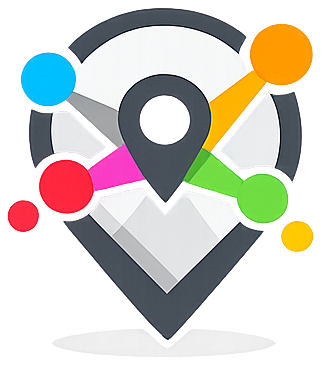

<div align="center">



# Scatter

> A browser-based OSINT mapping and geospatial analysis tool.

[]()
[](https://github.com/Project-Eyrie)


</div>

---

## Overview

**Scatter** is a web-based geospatial analysis toolkit built for OSINT researchers, investigators, and analysts. It combines pin placement, drawing tools, route planning, distance analysis, and analyst tools into a single map interface with shareable compressed URLs, encrypted file export, and full JSON/CSV import/export.

---

## Features

### Core

- **Pin Management** - Place, label, and organize map markers with custom icons, color-coded layers, timestamps, azimuth/bearing, radius, altitude, speed, and notes
- **25+ Pin Icons** - Home, airport, restaurant, hospital, school, star, crosshair, shield, camera, and more
- **Azimuth Sectors** - Pins with a bearing value render a 120-degree directional sector on the map
- **Accuracy Circles** - Pins with a radius value render a semi-transparent accuracy circle
- **Drawing Tools** - Create paths, arrows, polygons, circles, and text notes with customizable stroke widths and animated/directional paths
- **Measurement** - Measure distances between points with per-segment labels, total distance, and area/perimeter calculations
- **Route Planning** - Multi-waypoint routes with driving/walking modes, per-segment details, and total distance/time
- **Nearby Search** - Find places within a configurable radius using Google Places
- **Layer System** - Organize pins and drawings into named, color-coded groups with visibility toggles
- **Marker Clustering** - Groups nearby pins at lower zoom levels with cluster stats popup
- **Timeline** - Scrub through timestamped pins, drawings, azimuth sectors, and radius circles chronologically
- **Heatmap** - Toggle a heatmap overlay to visualize pin density
- **Street View** - Integrated Google Street View for any selected pin
- **3D View** - Photorealistic 3D buildings and terrain via Google Maps Map3DElement with synced pin markers
- **Configurable Label Zoom** - Adjust at what zoom level pin labels appear via the Labels dropdown

### Analyst Tools

- **Distance Circles** - Search a location, set a radius, draw color-coded circles on the map for distance estimation
- **Distance Matrix** - Color-coded straight-line distance grid between all visible pins
- **Crowd Estimator** - Estimate crowd capacity for an area at four density levels (light, moderate, dense, crush)
- **Sun Position** - Sun azimuth, altitude, sunrise/sunset, and golden hour for any date/time with sun direction and shadow lines on the map
- **Timezone** - Approximate timezone name, UTC offset, and local time for the map center
- **Weather** - Fetch current weather conditions (temperature, wind, humidity, pressure, visibility, clouds) from OpenWeatherMap with optional tile overlays (temperature, wind, precipitation, cloud cover, pressure)
- **Travel Calculator** - Estimate walking and driving times for a given distance and speed range

### Data

- **JSON Import/Export** - Save and restore full map state including all pin fields, drawings, layers, routes, and view settings
- **Encrypted Export** - Export map data as an AES-256-GCM encrypted .scatter file with password protection
- **CSV Import/Export** - Import/export pins with auto-detected columns for latitude, longitude, label, timestamp, azimuth, radius, altitude, speed, icon, layer, and notes
- **Auto-Layer Creation** - CSV import auto-creates layers from a layer/group column
- **Link Sharing** - Compress full map state into a shareable URL with optional AES-GCM encryption
- **Pin Search & Filtering** - Filter pins by name, layer, and timestamp status

---

## Interface

| Area | Description |
|------|-------------|
| **Header** | Logo, File menu (import/export JSON, CSV, encrypted), Edit menu (undo, redo, clear all), Tools menu, live cursor coordinates, Panels toggle, Share button |
| **Sidebar** | Google Places search, layer management, tabbed panels for pins, routes, and annotations |
| **Map** | Google Maps with right-click context menu, satellite/roadmap toggle, 3D view, heatmap, clustering, label controls |
| **Drawing Toolbar** | Bottom of map, always visible. Path, Arrow, Area, Radius, Note, Measure tools |
| **Properties Panel** | Fixed right-side panel showing all fields for the selected pin or drawing, collapsible with "Extended" section |
| **Tool Panels** | Fixed panels for active analyst tools (distance circles, crowd estimator, sun position, timezone, weather) |
| **Bottom Panel** | Collapsible (hidden by default) with distance matrix, street view, and travel calculator |

### Keyboard Shortcuts

| Shortcut | Action |
|----------|--------|
| `Ctrl + Z` | Undo |
| `Ctrl + Shift + Z` / `Ctrl + Y` | Redo |
| `Delete` / `Backspace` | Remove selected pin or drawing |
| `Enter` | Finish current drawing |
| `Escape` | Close modal |

---

## Setup

### Environment Variables

```
VITE_GOOGLE_MAPS_API_KEY=your_key        # Required - Google Maps JavaScript API key
VITE_GOOGLE_MAPS_MAP_ID=your_map_id      # Required - Google Cloud Console Map ID (Vector type)
VITE_GOOGLE_MAPS_MAP_ID_SATELLITE=id     # Optional - Separate Map ID for satellite view (e.g. with POI hidden)
VITE_OPENWEATHERMAP_API_KEY=your_key     # Optional - OpenWeatherMap API key for weather tool
```

### Google Maps API

Requires a Google Maps JavaScript API key with these APIs enabled:
- Maps JavaScript API
- Places API
- Geocoding API
- Directions API
- Street View API

The Map ID must be created in Google Cloud Console as **JavaScript - Vector** type for 3D globe view and building rendering. The `v=beta` channel is used for Map3DElement support.

### Google Cloud Console Map Styling

POI (Points of Interest) visibility is controlled via the Map ID's associated style in Google Cloud Console, not client-side. To hide POI on satellite view, create a separate Map ID with a style that has POI labels turned off.

---

## Technical Details

### Link Sharing

Map state is serialized to compact JSON with single-letter keys, compressed with DeflateRaw via the CompressionStream API, encoded as URL-safe base64, and stored in the URL hash fragment. Extended pin fields (azimuth, radius, altitude, speed, notes) are included when present. Optional AES-GCM encryption uses PBKDF2 key derivation with 100,000 iterations. URLs are capped at 32,000 characters.

### Encrypted Export

The .scatter file format is deflate-compressed JSON encrypted with AES-256-GCM. Same encryption as share links but without URL length constraints.

### Geographic Calculations

- Distance: Haversine formula
- Polygon area: Spherical excess method
- Label placement: Mercator projection math for overlap resolution
- Azimuth sectors: 120-degree cone rendered as a Google Maps Polygon
- Sun position: Standard solar equations (Julian date, declination, hour angle)

### Stack

SvelteKit, Svelte 5, TypeScript, Tailwind CSS 4, Vite, Google Maps JavaScript API (beta), OpenWeatherMap API, deployed on Vercel.

---

## Notes

- Desktop only (1024px+ screen width)
- Requires CompressionStream API (Chrome 80+, Firefox 113+, Safari 16.4+, Edge 80+)
- Uses Google Maps `v=beta` channel for Map3DElement (3D view)
- Coordinates rounded to 6 decimal places (~1m precision) in shared URLs
- Pin labels: 80 chars, note text: 200 chars, layer names: 40 chars, CSV import: 100 pins max

---

<div align="center">
  Part of Project Eyrie - by <a href="https://notalex.sh">notalex.sh</a>
</div>
